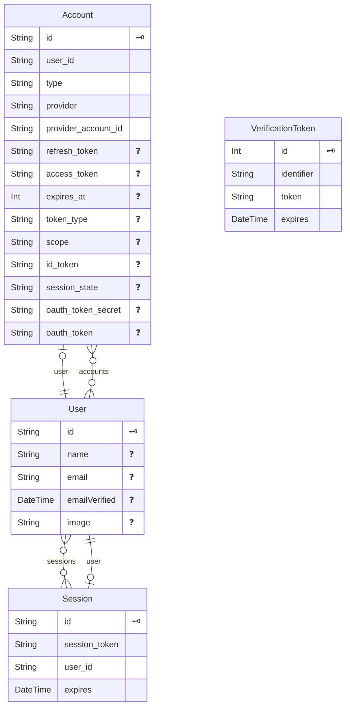

```mermaid
erDiagram

  "Account" {
    String id "🗝️"
    String user_id 
    String type 
    String provider 
    String provider_account_id 
    String refresh_token "❓"
    String access_token "❓"
    Int expires_at "❓"
    String token_type "❓"
    String scope "❓"
    String id_token "❓"
    String session_state "❓"
    String oauth_token_secret "❓"
    String oauth_token "❓"
    }
  

  "Session" {
    String id "🗝️"
    String session_token 
    String user_id 
    DateTime expires 
    }
  

  "User" {
    String id "🗝️"
    String name "❓"
    String email "❓"
    DateTime emailVerified "❓"
    String image "❓"
    }
  

  "VerificationToken" {
    Int id "🗝️"
    String identifier 
    String token 
    DateTime expires 
    }
  
    "Account" o|--|| "User" : "user"
    "Session" o|--|| "User" : "user"
    "User" o{--}o "Account" : "accounts"
    "User" o{--}o "Session" : "sessions"
```
