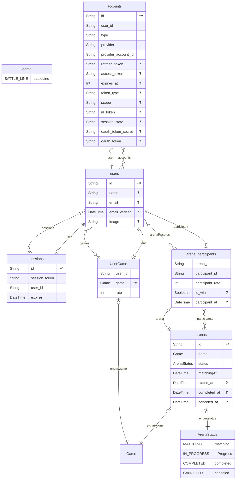

```mermaid
erDiagram

        game {
            BATTLE_LINE battleLine
        }
    


        ArenaStatus {
            MATCHING matching
IN_PROGRESS inProgress
COMPLETED completed
CANCELED canceled
        }
    
  "accounts" {
    String id "🗝️"
    String user_id 
    String type 
    String provider 
    String provider_account_id 
    String refresh_token "❓"
    String access_token "❓"
    Int expires_at "❓"
    String token_type "❓"
    String scope "❓"
    String id_token "❓"
    String session_state "❓"
    String oauth_token_secret "❓"
    String oauth_token "❓"
    }
  

  "sessions" {
    String id "🗝️"
    String session_token 
    String user_id 
    DateTime expires 
    }
  

  "users" {
    String id "🗝️"
    String name "❓"
    String email "❓"
    DateTime email_verified "❓"
    String image "❓"
    }
  

  "UserGame" {
    String user_id 
    Game game "🗝️"
    Int rate 
    }
  

  "arenas" {
    String id "🗝️"
    Game game 
    ArenaStatus status 
    DateTime matchingAt 
    DateTime stated_at "❓"
    DateTime completed_at "❓"
    DateTime canceled_at "❓"
    }
  

  "arena_participants" {
    String arena_id 
    String participant_id 
    Int participant_rate 
    Boolean id_win "❓"
    DateTime participant_at "❓"
    }
  
    "accounts" o|--|| "users" : "user"
    "sessions" o|--|| "users" : "user"
    "users" o{--}o "accounts" : "accounts"
    "users" o{--}o "sessions" : "sessions"
    "users" o{--}o "arena_participants" : "arenaRecords"
    "users" o{--}o "UserGame" : "games"
    "UserGame" o|--|| "Game" : "enum:game"
    "UserGame" o|--|| "users" : "user"
    "arenas" o|--|| "Game" : "enum:game"
    "arenas" o|--|| "ArenaStatus" : "enum:status"
    "arenas" o{--}o "arena_participants" : "participants"
    "arena_participants" o|--|| "arenas" : "arena"
    "arena_participants" o|--|| "users" : "participant"
```
